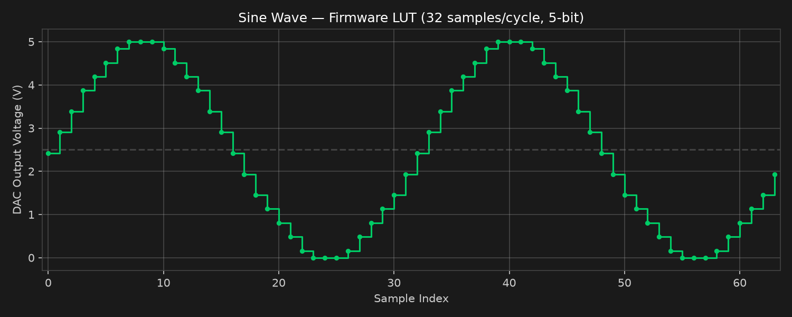
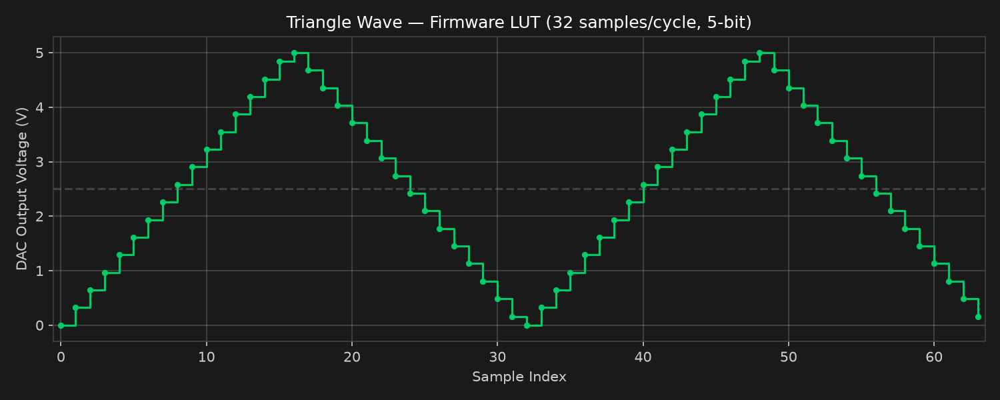
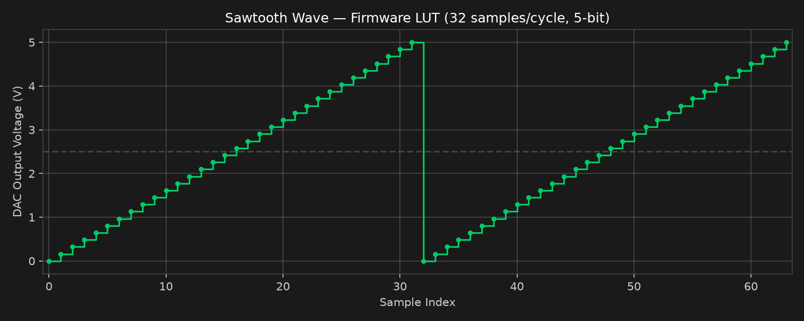
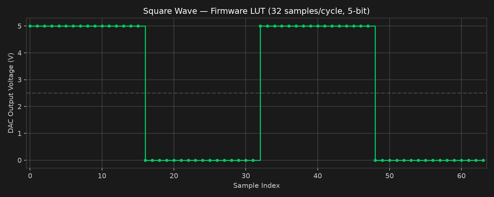
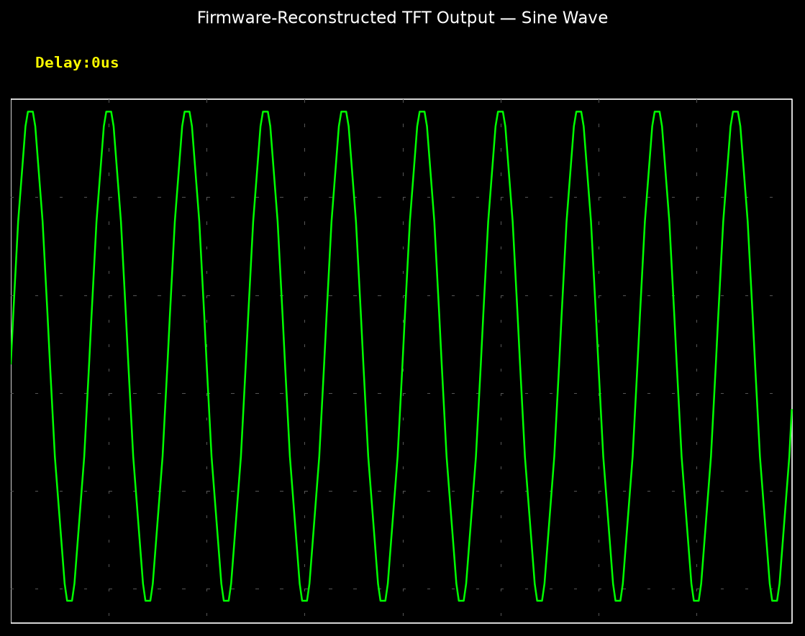
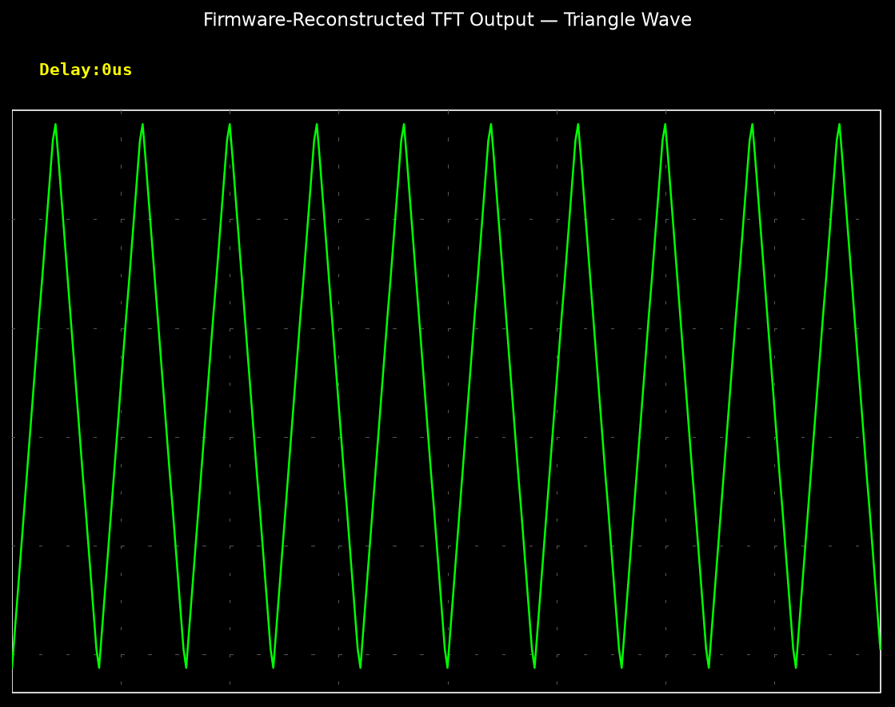
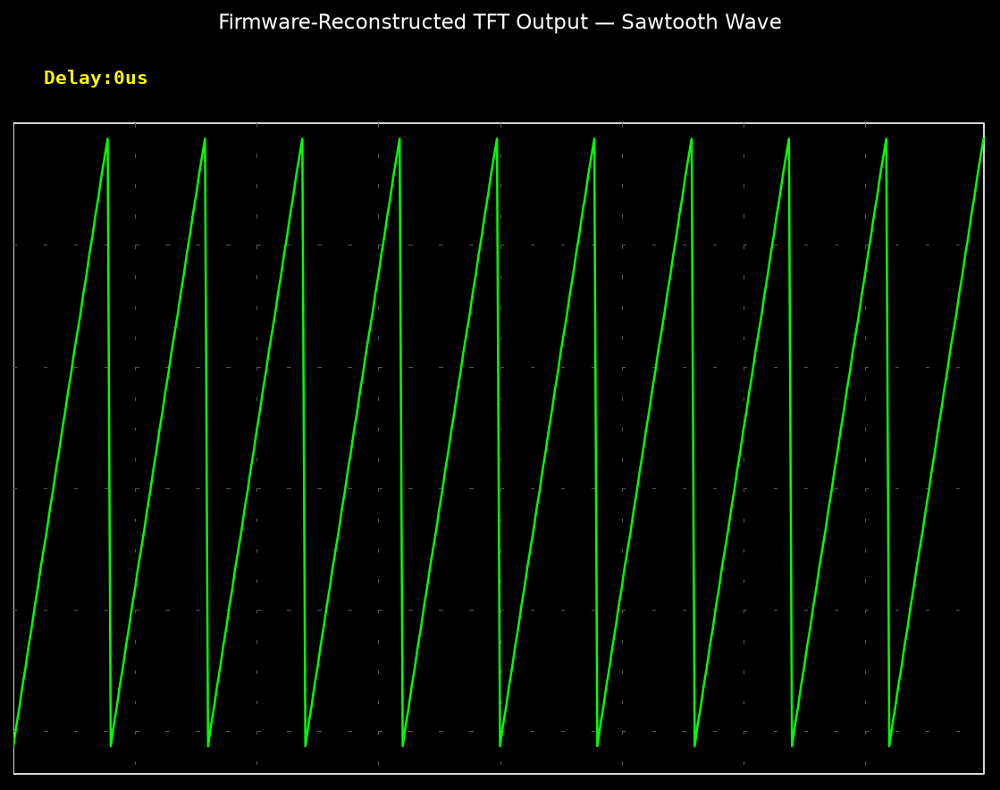
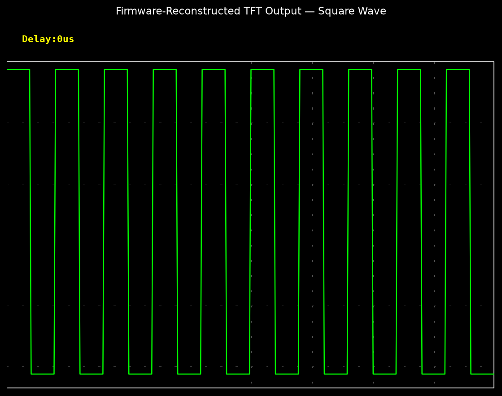

# Digital Oscilloscope — STM32

> Embedded waveform generation and visualization system using STM32-based button control, an Arduino R-2R DAC function generator, and a TFT-based signal acquisition display.

---

## Project Status

**Status:** Functional Prototype (V1)

**Type:** Academic Embedded Systems Project

**Institution:** Vellore Institute of Technology, Chennai

**Course:** Embedded C Programming

---

## Overview

This project implements a multi-module embedded signal generation and visualization system:

1. **STM32 Master Controller** — Reads four physical buttons and transmits single-character UART commands for system control.
2. **Waveform Generator** — Arduino-based 5-bit R-2R DAC function generator producing sine, triangle, sawtooth, and square waveforms using 32-sample lookup tables.
3. **Display and Acquisition Module** — Arduino with MCUFRIEND TFT shield (ILI9341-compatible, 320x240) that acquires analog signals via `analogRead()` and renders real-time waveform traces.

The system demonstrates fundamental concepts of DAC-based waveform synthesis, real-time analog acquisition, and embedded display rendering.

---

## Key Features

### Currently Implemented

- 5-bit R-2R DAC waveform generation (4 waveform types)
- 32-sample lookup tables for sine, triangle, sawtooth, and square waves
- Non-blocking button debounce on waveform generator
- Real-time 320-sample analog signal acquisition and display
- TFT oscilloscope-style grid with waveform trace rendering
- Adjustable time base (sample delay) via UP/DOWN buttons
- HOLD mode to freeze waveform display
- STM32 button controller with UART command transmission
- Serial plotter output for waveform verification

### Planned Improvements

- Timer-triggered ADC sampling for precise sample rates
- DMA circular buffering for continuous acquisition
- Software edge trigger detection with configurable threshold
- Pre-trigger capture buffer
- Voltage scaling and calibration
- Time/division calibrated display
- UART command reception in display module (completing STM32 integration)
- 12-bit ADC utilization on STM32

---

## System Architecture

See [docs/architecture.md](docs/architecture.md) for the full system architecture with data flow diagrams.

```
  Buttons ──► STM32 Controller ──UART──► (Future: Display Module)
                                              │
  Button ──► Waveform Generator               │
                  │                            │
             5-bit Digital Output              │
                  │                            │
              R-2R DAC                         │
                  │                            │
           Analog Waveform ──────────► Signal Acquisition
                                              │
                                        TFT Display
```

---

## Hardware Components

| Component | Role |
|-----------|------|
| STM32F103C8T6 (Blue Pill) | Master button controller, UART command source |
| Arduino Uno/Mega | Waveform generator (R-2R DAC output) |
| Arduino Uno/Mega + TFT Shield | Signal acquisition and display |
| MCUFRIEND 2.4" TFT (ILI9341) | 320x240 waveform visualization |
| R-2R Resistor Ladder | 5-bit digital-to-analog converter |
| Push Buttons (x5) | Waveform selection and display controls |
| Resistors | R-2R ladder network |

---

## Repository Structure

```
Digital-Oscilloscope-STM32/
├── README.md
├── LICENSE
├── .gitignore
│
├── firmware/
│   ├── stm32_controller/
│   │   ├── stm32_master.ino       # STM32 button reader + UART transmitter
│   │   └── README.md
│   └── display_acquisition/
│       ├── display_acquisition.ino # TFT signal acquisition and display
│       └── README.md
│
├── waveform_generator/
│   ├── waveform_generator.ino     # R-2R DAC function generator
│   └── README.md
│
├── hardware/
│   ├── pin_mapping.md             # All pin assignments from source code
│   └── BOM.md                     # Bill of materials
│
├── docs/
│   ├── PROJECT_REPORT.pdf         # Original academic report
│   ├── architecture.md            # System architecture and data flow
│   ├── working_principle.md       # Step-by-step operation
│   ├── performance.md             # Verified performance parameters
│   └── limitations.md             # Current limitations and V2 roadmap
│
├── tools/
│   └── generate_waveforms.py      # Reproducible waveform visualization
│
├── results/
│   └── simulated/
│       └── README.md              # Explanation of simulated outputs
│
└── images/
    ├── System_Architecture.png.avif
    ├── Waveform_Square.png.jpeg
    └── README.md
```

---

## Build and Upload Instructions

### STM32 Master Controller

1. Install [Arduino IDE](https://www.arduino.cc/en/software) with [STM32duino board package](https://github.com/stm32duino/Arduino_Core_STM32)
2. Select board: **Generic STM32F1 series** > **BluePill F103C8**
3. Open `firmware/stm32_controller/stm32_master.ino`
4. Upload via ST-Link or USB bootloader

### Waveform Generator

1. Open `waveform_generator/waveform_generator.ino` in Arduino IDE
2. Select board: **Arduino Uno** (or compatible AVR board)
3. Connect R-2R ladder to digital pins 8-12
4. Upload

### Display and Acquisition

1. Open `firmware/display_acquisition/display_acquisition.ino` in Arduino IDE
2. Install libraries: `Adafruit_GFX`, `MCUFRIEND_kbv`
3. Mount MCUFRIEND TFT shield on Arduino
4. Connect analog signal to pin A5
5. Upload

---

## Results

The `results/simulated/` directory contains software-reconstructed waveform outputs generated directly from the firmware lookup tables using `tools/generate_waveforms.py`.

These are **code-derived visualizations**, not photographs or live captures from hardware. The original prototype has been dismantled. All outputs are reproducible from the source LUT data.

### Waveform LUT Reconstructions

| Sine | Triangle |
|------|----------|
|  |  |

| Sawtooth | Square |
|----------|--------|
|  |  |

### Firmware-Reconstructed TFT Display Output

| Sine | Triangle |
|------|----------|
|  |  |

| Sawtooth | Square |
|----------|--------|
|  |  |

> All images above are firmware-reconstructed display outputs, not hardware photographs.

---

## Limitations

See [docs/limitations.md](docs/limitations.md) for a complete list. Key limitations include:

- 5-bit DAC resolution (32 voltage levels)
- 32-sample lookup table resolution
- Delay-based waveform timing (not timer-interrupt driven)
- `analogRead()`-based acquisition (not DMA)
- No trigger detection in current firmware
- STM32 UART commands not received by display module (integration gap)

---

## Future Improvements

| Improvement | Description |
|-------------|-------------|
| Timer-triggered ADC | Replace `analogRead()` with timer-driven ADC for precise sampling |
| DMA acquisition | Circular buffer with DMA for continuous, CPU-free sampling |
| Trigger detection | Software rising/falling edge trigger with configurable threshold |
| UART integration | Display module receives commands from STM32 controller |
| Voltage calibration | Calibrated voltage/division display |
| Higher resolution DAC | 8-bit or 10-bit R-2R ladder for smoother waveforms |
| FFT spectrum view | Frequency domain analysis |
| STM32F4 migration | Higher clock speed and ADC performance |

---

## References

1. STM32F103C8T6 Datasheet — STMicroelectronics
2. ILI9341 TFT Controller Datasheet
3. R-2R Resistor Ladder DAC — Analog Devices Application Note
4. Adafruit GFX Library Documentation
5. MCUFRIEND_kbv Library — GitHub

---

## Author

**Allen Joe A**

B.Tech Electronics and VLSI Engineering

Vellore Institute of Technology, Chennai

---

## License

This project is licensed under the [MIT License](LICENSE).

---

**Topics**: `stm32` `arduino` `oscilloscope` `waveform-generator` `r2r-dac` `tft-display` `embedded-systems` `signal-processing`
