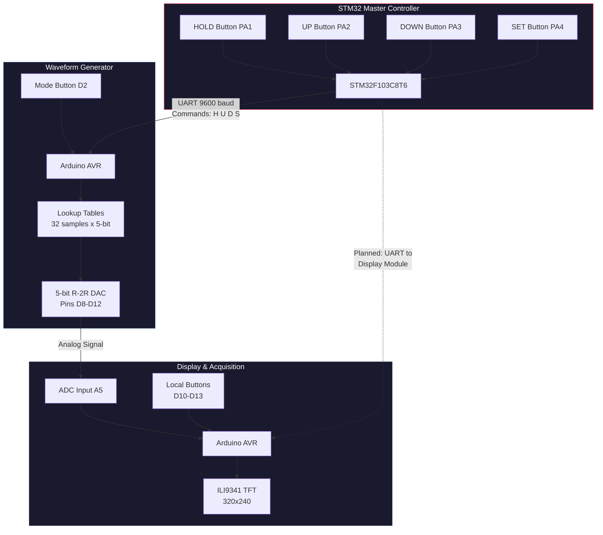
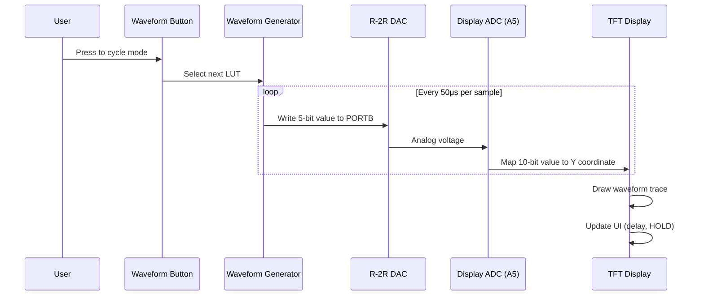

# System Architecture

## High-Level Overview

The Digital Oscilloscope system consists of three independent microcontroller modules connected through analog signal paths and UART communication.

## Module Responsibilities

### STM32 Master Controller (`firmware/stm32_controller/`)

| Responsibility | Implementation |
|---------------|---------------|
| Button input | 4 buttons with INPUT_PULLUP, edge detection |
| UART output | Single-char commands via Serial1 (PA9, 9600 baud) |
| Debug output | USB Serial at 9600 baud |

**UART Command Protocol:**

| Command | Trigger | Intended Action |
|---------|---------|----------------|
| `'H'` | HOLD button press | Toggle waveform hold |
| `'U'` | UP button press | Increase parameter |
| `'D'` | DOWN button press | Decrease parameter |
| `'S'` | SET button press | Reset/set parameter |

### Waveform Generator (`waveform_generator/`)

| Responsibility | Implementation |
|---------------|---------------|
| Waveform synthesis | 32-sample LUTs for 4 waveform types |
| DAC output | Direct PORTB register write to R-2R ladder |
| Mode selection | Button on D2 with non-blocking debounce |
| Feedback | analogRead(A0) to Serial plotter |

**Waveform Types:**

| Mode | Type | LUT Characteristics |
|------|------|-------------------|
| 0 | Sine | Quantized, values 0-31, symmetric |
| 1 | Triangle | Linear ramp, values 0-31, up then down |
| 2 | Sawtooth | Linear 0-31 in 32 steps |
| 3 | Square | 31 for 16 steps, 0 for 16 steps |

### Display and Acquisition (`firmware/display_acquisition/`)

| Responsibility | Implementation |
|---------------|---------------|
| Signal acquisition | `analogRead(A5)`, 10-bit, 320 samples per sweep |
| Display rendering | Line-drawing on ILI9341 via MCUFRIEND_kbv |
| UI | Delay value display, HOLD indicator |
| Controls | Local buttons for HOLD, UP, DOWN, SET |

## Data Flow

## Integration Status

| Link | Status | Notes |
|------|--------|-------|
| Waveform Generator → DAC → Display ADC | Implemented | Analog signal path works |
| STM32 → Waveform Generator (UART) | Partial | STM32 transmits, but waveform generator does not read UART |
| STM32 → Display Module (UART) | Not implemented | Display uses local buttons |
| Waveform Generator → Serial Plotter | Implemented | Debug feedback via analogRead(A0) |
